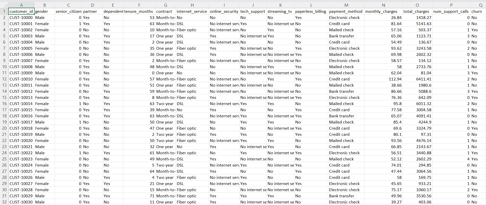
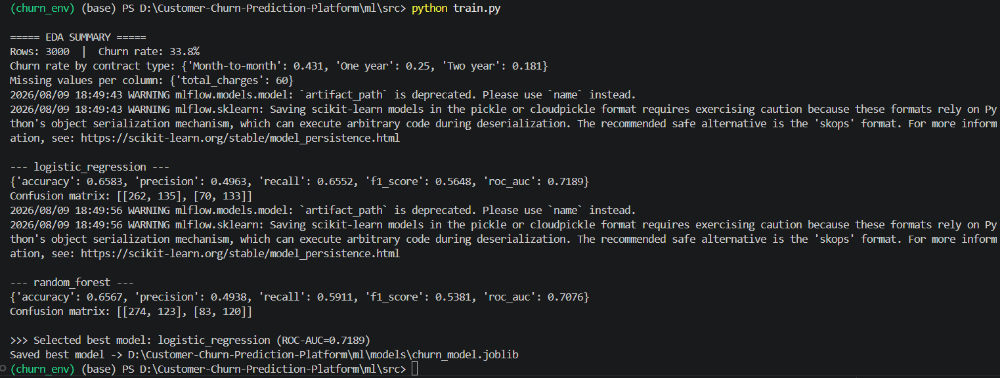
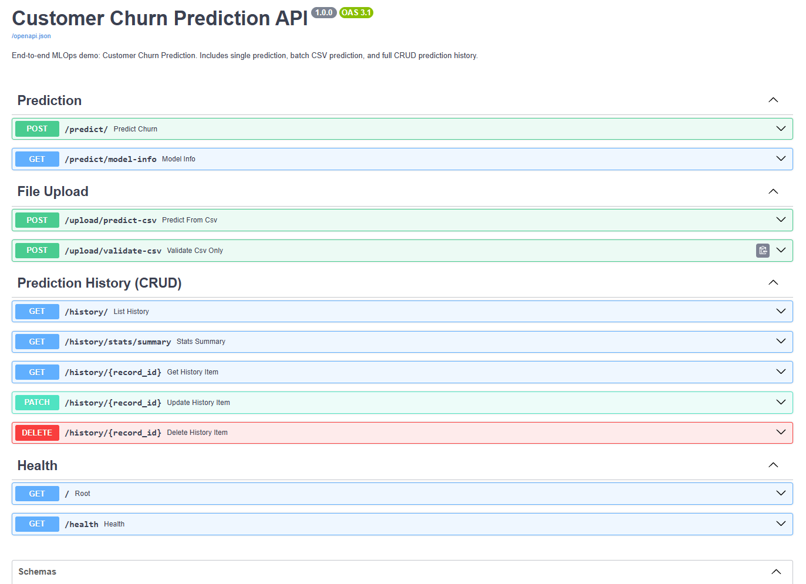
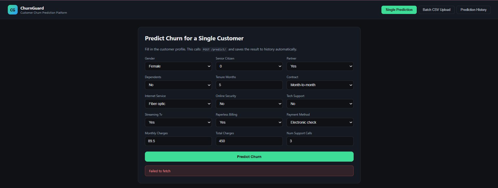
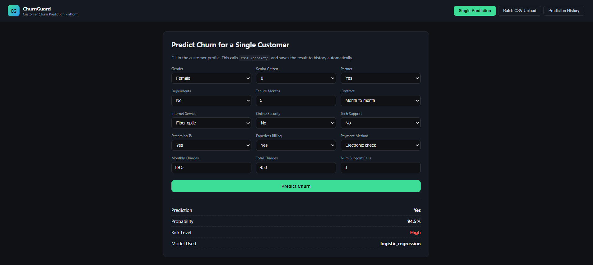
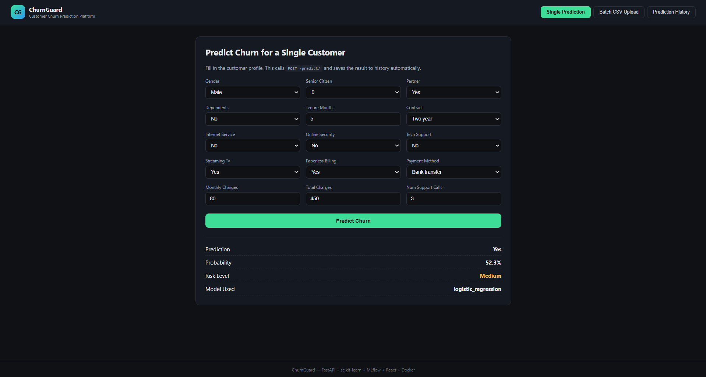
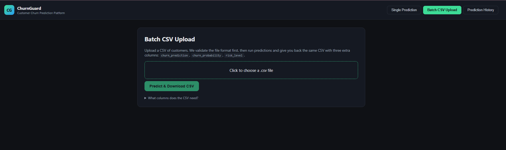
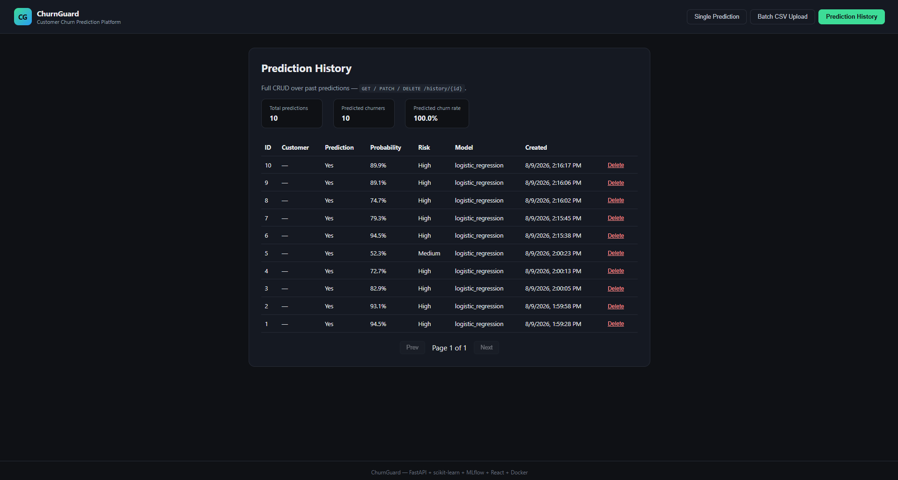

# Customer-Churn-Prediction-Platform
I Built a complete, production-style ML project: Customer Churn Prediction Platform with full ML pipeline, FastAPI backend (CRUD + file upload), React frontend, Docker, MLflow tracking, and pytest.

# --------------------------------------------------
`
python -m venv churn_env
`

`
.\churn_env\Scripts\Activate.ps1
`

## -------------------------------------------------

## -------------------------------------------------

## -------------------------------------------------

## -------------------------------------------------
Run code following in backend folder:

(churn_env) (base) PS D:\Customer-Churn-Prediction-Platform\backend> `python -m uvicorn app.main:app --reload`

## -------------------------------------------------

(churn_env) (base) PS D:\Customer-Churn-Prediction-Platform\backend> `python -m uvicorn app.main:app --reload`

## -------------------------------------------------
`
npm install
`
`
npm start
`

## Front-End Looking Like:

## -------------------------------------------------

## Alway run frontend and run backend above shown then works good

## -------------------------------------------------
`
pip install --upgrade scikit-learn==1.9.0
`
## -------------------------------------------------

## -------------------------------------------------

## -------------------------------------------------

## -------------------------------------------------

